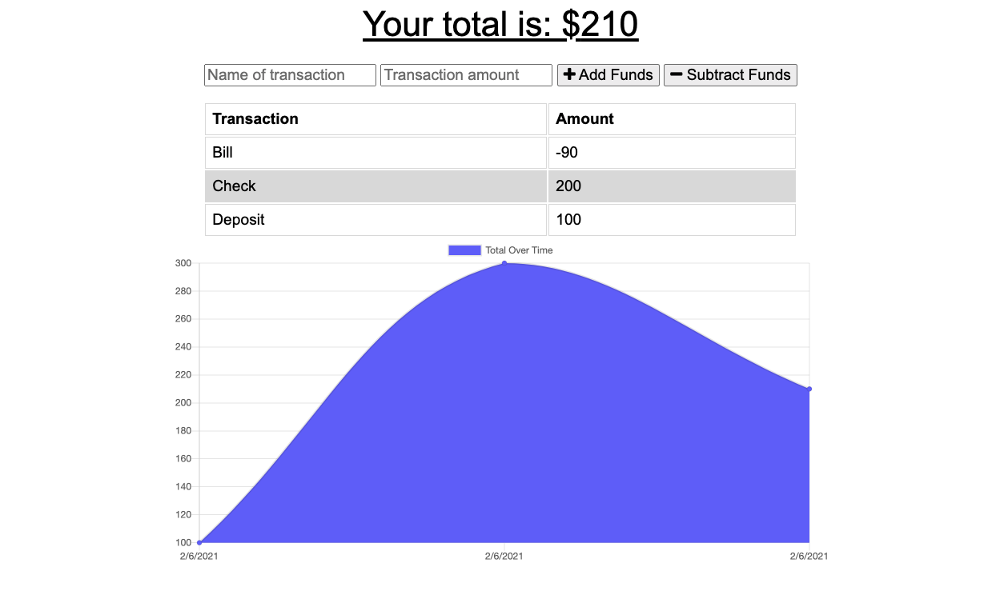

# Unit 18 Homework: Progressive Budget

## Description

This budget tracker app allows users to add expenses and deposits to their budget with or without a connection. When entering transactions offline, the total will populate when brought back online.

Offline Functionality:

- Enter deposits offline

- Enter expenses offline

When brought back online:

- Offline entries should be added to tracker.

## Table of Contents

- [Installation](#installation)
- [Usage](#usage)
- [Technology Used](#technology-used)
- [Questions](#questions)

## Installation

To install necessary dependencies, run the following command.

```bash
npm i
```

## Usage

Visit the website (linked below) and start tracking your budget!

https://protected-wildwood-05521.herokuapp.com/



## Technology Used

- JS ES6
- Mongoose
- Heroku
- Express
- NPM
- HTML + CSS

## Questions

If you have any questions about the repo, open an issue or contact me directly at [kelseyeckelberry@gmail.com](kelseyeckelberry@gmail.com). You can find more of my work at [kelseyeckelberry](https://github.com/kelseyeckelberry).
